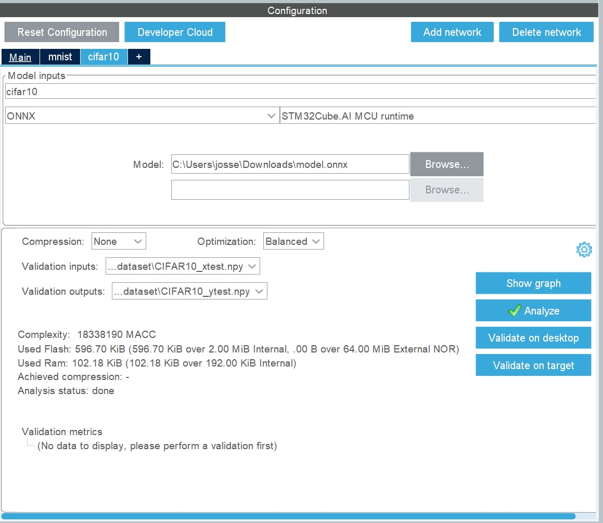
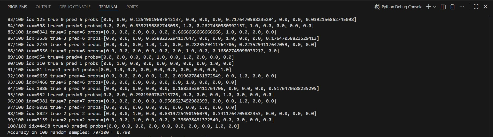

# Déploiement d’un modèle DNN préentraîné sur le dataset CIFAR-10 pour microcontrôleur

Ce projet étudie le **déploiement d’un modèle de classification** sur une cible embarquée **STM32**.  

---

# 🧩 Sommaire 

## ⚙️ Partie 1 — Déploiement sur microcontrôleur

La seconde partie porte sur le **déploiement du modèle conçu** sur la cible **STM32**.

### Contenu :
- **Fichiers d'analyse** des différents modèles obtenus grâce à STM32-CUBE-AI dans le dossier **`Analyse modèle de base`**
- **Fichiers de déploiement** pour le microcontrôleur ;  
- **Modèle converti** et prêt à être intégré sur la plateforme embarquée.

---

## 🧠 Partie 2 — Conception du modèle

Cette première partie concerne la **conception et l’optimisation** du modèle via :
- l’élaboration d’une **méthode de pruning**,  
- la **sélection d’une architecture personnalisée**,  
- et l’**évaluation** de cette dernière sur le dataset **CIFAR-10**.

### Contenu :
- **`Pruning.pdf`** — rapport détaillant la méthode de pruning et les choix d’architecture du nouveau modèle ;  (dossier *Pruning*) 
- **`pruning_modele.ipynb`** — démonstration pratique de la méthode de pruning appliquée au modèle. (dossier *Pruning*) 
- **`entrainement_evaluation.ipynb`** - code d'entrainement et d'évaluation du modèle. 
- **`outils.ipynb`** - Ensemble de fonctions, pour la plupart absentes des autres notebooks, mais qui nous ont permis d’explorer la méthode de **pruning** et son évaluation.
- **`resultats_pruning.xlxs`** Tableau récapitulatif de l'ensemble des résultats obtenus pour les différentes méthodes de pruning (dossier *Pruning*) 
- **`resultats_pruning_bruts.txt`** Document enregistrants l'ensemble des résultats brutes pour les différentes méthodes de pruning (dossier *Pruning*) 
---

## 💣 Partie 3 - Attaque du modèle 

Cette troisième partie porte sur l'attaque du modèle déployé sur le microcontrôleur. 
### Contenu : 
📁 Structure du dossier
🔹 Racine

**`run_bfa_attack.py`**
Script principal exécutant l’attaque BFA sur le modèle de base.
Contient les fonctions d’initialisation, de gestion des poids, et de lancement de l’attaque.

**`run_bfa_pruned.py`**
Variante de l’attaque appliquée sur le modèle déjà pruné.

**`run_bfa_attack_error.log`**
Fichier de log regroupant les erreurs et événements rencontrés lors des exécutions.

**`bfa_attack_vs_random.png`**
Graphique comparant les performances du modèle après attaque BFA et après attaque aléatoire.

**`weights.pth`**
Poids initiaux du modèle avant toute attaque.

**`weights_attacked.pth`**
Poids du modèle après l’application de l’attaque BFA.

**`pruned_model.pth`**
Version allégée (après pruning) du modèle utilisée dans certains tests.

🔹 Dossier attack/

Contient les modules liés à la mise en œuvre des attaques :

**`BFA.py`**
Implémentation de la Bit-Flip Attack, permettant de cibler des bits spécifiques dans les poids du modèle pour maximiser la dégradation des performances.

**`random_attack.py`**
Attaque de référence : applique des flips aléatoires sur les bits des poids du modèle pour comparaison.

**`data_conversion.py`**
Outils de manipulation et de conversion des poids (float ↔ binaire) pour permettre l’injection de fautes au niveau bit.

📊 Résultats et visualisations

Le graphique **`bfa_attack_vs_random.png`** illustre la différence d’impact entre une attaque aléatoire (Random) et une attaque dirigée (BFA), ciblant les bits les plus sensibles.

---

# 📖 Documentation

## Analyse du modèle existant

Cette analyse présente l'architecture VG11 modifiée et optimisée pour la classification d'images CIFAR-10. L'architecture VGG, introduite par Simonyan et Zisserman en 2014, utilise réseaux profonds avec exclusivement des filtres de convolutions de petite taille (3×3), principe qui est conservé dans cette adaptation.

### Caractéristiques principales

- **8 couches convolutionnelles** organisées en 6 blocs distincts qui extraient progressivement des features de plus en plus abstraites
- **Classificateur dense** à 3 couches qui transforme les features extraites en prédictions de classes
- **~1.34 millions de paramètres** (optimisé pour CIFAR-10, bien inférieur aux 132M du VGG-11 original)
- **Régularisation moderne** : BatchNormalization pour la stabilité et SpatialDropout2D pour la robustesse

## 🏗️ Architecture

### Philosophie de conception

L'architecture s'inspire du paradigme VGG classique avec des améliorations modernes adaptées aux défis spécifiques du dataset CIFAR-10 :

- **Filtres uniformes** : Noyaux 3×3 exclusivement, permettant un empilement profond avec un nombre de paramètres réduit
- **Profondeur contrôlée** : 8 couches convolutionnelles, un compromis entre la capacité d'apprentissage et le risque de sur-apprentissage
- **Régularisation** : BatchNorm après chaque activation et SpatialDropout2D dans les blocs stratégiques
- **Adaptation** : Optimisée pour images 32×32 pixels avec un nombre de filtres maximal de 128 (vs 512 dans VGG original)

### Structure hiérarchique

Le modèle suit une structure pyramidale à 4 niveaux où les dimensions spatiales diminuent progressivement tandis que la profondeur des canaux augmente. Cette approche classique permet de capturer d'abord des détails fins avec une haute résolution, puis des concepts de plus en plus abstraits :

1. **Bloc 1** : Extraction des caractéristiques de bas niveau (32 filtres) - détection des contours, transitions de couleurs
2. **Bloc 2** : Consolidation des motifs élémentaires (32 filtres) avec première réduction spatiale
3. **Bloc 3** : Capture des motifs intermédiaires (64 filtres) - textures, formes géométriques simples
4. **Bloc 4** : Approfondissement des features intermédiaires (64 filtres) avec deuxième réduction spatiale
5. **Bloc 5** : Extraction des caractéristiques de haut niveau (128 filtres) - parties d'objets, motifs complexes
6. **Bloc 6** : Raffinement final (128 filtres) avec résolution spatiale minimale

## 📊 Détails de l'architecture

### Progression des caractéristiques

Le tableau ci-dessous montre l'évolution des dimensions et de la complexité à travers le réseau. On observe que le volume d'information croît initialement, puis décroît progressivement grâce aux opérations de max pooling :

| Bloc | Canaux entrée | Canaux sortie | Dimension spatiale | Volume total |
|------|---------------|---------------|--------------------|--------------| 
| 1 | 3 | 32 | 32×32 | 32,768 valeurs |
| 2 | 32 | 32 | 32×32 → 16×16 | 8,192 valeurs |
| 3 | 32 | 64 | 16×16 | 16,384 valeurs |
| 4 | 64 | 64 | 16×16 → 8×8 | 4,096 valeurs |
| 5 | 64 | 128 | 8×8 → 4×4 | 2,048 valeurs |
| 6 | 128 | 128 | 4×4 → 2×2 | 512 valeurs |

La progression montre une compensation intelligente : quand la résolution spatiale diminue de moitié, le nombre de canaux double, maintenant ainsi la capacité représentationnelle du réseau.

### Classificateur dense

Le classificateur adopte une architecture en pyramide inversée, contrastant avec la structure en entonnoir de la partie convolutionnelle. Cette expansion puis contraction permet de combiner richement les features extraites :

- **Flatten** : 512 dimensions (128 × 2 × 2), transformation du tenseur 3D en vecteur 1D
- **Dense 1** : 512 → 1024 (ReLU + Dropout 0.3) - expansion pour créer un espace de combinaisons riche
- **Dense 2** : 1024 → 512 (ReLU + Dropout 0.3) - synthèse et compression de l'information discriminante
- **Sortie** : 512 → 10 (Softmax) - projection vers les 10 classes avec distribution de probabilité

## 🔧 Innovations architecturales

### BatchNormalization stratégique

Intégrée après chaque activation ReLU dans tous les blocs convolutionnels, la BatchNormalization normalise la distribution des activations en ajustant leur moyenne à 0 et leur variance à 1. Cette technique apporte plusieurs bénéfices mesurables :

- **Stabiliser** la variance interne des activations, réduisant le phénomène d'Internal Covariate Shift
- **Accélérer** la convergence durant l'entraînement en permettant des learning rates plus élevés
- **Régulariser** implicitement le modèle grâce au bruit introduit par les statistiques de batch
- **Renforcer** la robustesse à l'initialisation des poids, facilitant l'expérimentation

La formule mathématique appliquée est : `x̂ = (x - μ_batch) / √(σ²_batch + ε)` suivie de `y = γ * x̂ + β`, où γ et β sont des paramètres apprenables qui permettent au réseau de retrouver la distribution originale si nécessaire.

### SpatialDropout2D

Amélioration significative par rapport au dropout classique, spécifiquement conçue pour les architectures convolutionnelles. Le SpatialDropout2D désactive aléatoirement des feature maps entières plutôt que des neurones individuels :

| Caractéristique | Dropout Classique | SpatialDropout2D |
|-----------------|-------------------|------------------|
| Unité de suppression | Neurones individuels | **Canaux complets** (25% avec taux 0.25) |
| Préservation spatiale | ❌ Non | ✅ Oui - maintient les corrélations spatiales |
| Corrélations locales | Perturbées par le bruit | Maintenues dans chaque feature map |
| Efficacité convolutionnelle | Limitée | Optimale pour les CNN |

Cette approche est plus efficace car les valeurs au sein d'une même feature map sont fortement corrélées spatialement (elles proviennent du même filtre). Désactiver des pixels aléatoires ne forcerait pas le réseau à développer des représentations robustes, alors que supprimer des canaux entiers oblige le réseau à ne pas dépendre excessivement de certaines features spécifiques.

### Séquence des opérations

**Séquence appliquée** : Conv2D → ReLU → [SpatialDropout2D] → BatchNorm → [MaxPool2D]

Cette séquence présente l'avantage de normaliser les activations après application du dropout, stabilisant ainsi la distribution des données d'entrée de la couche suivante. L'activation ReLU est appliquée avant la normalisation, ce qui permet de normaliser une distribution déjà filtrée par la non-linéarité.

## 📈 Distribution des paramètres

### Répartition par composant

Le tableau détaillé ci-dessous montre la distribution complète des paramètres à travers l'architecture. On observe un déséquilibre n vers les couches denses qui concentrent la majorité des paramètres :

| Composant | Paramètres | Pourcentage | Calcul détaillé |
|-----------|------------|-------------|-----------------|
| **Couches Convolutionnelles** | **287,008** | **21.4%** | |
| Conv2D (3→32) | 896 | 0.07% | 3×3×3×32 + 32 biais |
| Conv2D (32→32) | 9,248 | 0.69% | 3×3×32×32 + 32 biais |
| Conv2D (32→64) | 18,496 | 1.38% | 3×3×32×64 + 64 biais |
| Conv2D (64→64) | 36,928 | 2.75% | 3×3×64×64 + 64 biais |
| Conv2D (64→128) | 73,856 | 5.50% | 3×3×64×128 + 128 biais |
| Conv2D (128→128) | 147,584 | 11.0% | 3×3×128×128 + 128 biais |
| **BatchNormalization** | **896** | **0.07%** | |
| BN (32 canaux) × 2 | 128 | 0.01% | (γ + β) × 32 × 2 blocs |
| BN (64 canaux) × 2 | 256 | 0.02% | (γ + β) × 64 × 2 blocs |
| BN (128 canaux) × 2 | 512 | 0.04% | (γ + β) × 128 × 2 blocs |
| **Couches Denses** | **1,055,242** | **78.6%** | |
| Dense (512→1024) | 525,312 | 39.1% | 512×1024 + 1024 biais |
| Dense (1024→512) | 524,800 | 39.1% | 1024×512 + 512 biais |
| Dense (512→10) | 5,130 | 0.38% | 512×10 + 10 biais |
| **TOTAL** | **~1,343,146** | **100%** | |

### Analyse de l'efficacité

**Observations critiques** révélant les forces et faiblesses de l'architecture :

- **78.6%** des paramètres concentrés dans seulement 3 couches denses du classificateur
- Les deux premières couches denses contiennent à elles seules plus de 1 million de paramètres
- Cette concentration peut créer un risque de sur-apprentissage dans le classificateur
- Les couches convolutionnelles ne représentent que **21.4%** des paramètres mais effectuent l'essentiel du travail d'extraction de features
- La BatchNormalization ajoute un overhead paramétrique négligeable (0.07%) pour un bénéfice substantiel
- Meilleur équilibre que certaines architectures CNN basiques où les couches denses peuvent représenter >90% des paramètres

## ⚠️ Limitations et défis

### Limitations architecturales

Malgré ses qualités, l'architecture présente plusieurs limitations inhérentes à sa conception séquentielle pure :

- **Absence de skip connections** : Contrairement aux architectures ResNet qui utilisent des connexions résiduelles, ce modèle peut souffrir de problèmes de gradient dans les couches profondes
- **Pooling agressif** : Quatre opérations de max pooling réduisent l'image de 32×32 à 2×2, entraînant une perte potentielle d'information spatiale fine qui pourrait être discriminante
- **Architecture séquentielle** : Pas de parallélisation des branches comme dans Inception, limitant la diversité des features à chaque niveau
- **Classificateur dense dominant** : 78.6% des paramètres concentrés dans 3 couches denses peut créer un goulot d'étranglement et un risque de sur-apprentissage localisé

### Défis computationnels

Plusieurs aspects de l'architecture posent des problèmes  pratiques lors de l'entraînement et du déploiement :

- **Mémoire** : Les feature maps volumineuses des premières couches (32×32×32) nécessitent une mémoire GPU substantielle, surtout avec des batchs de grande taille
- **BatchNorm** : Dépendance à la taille du batch pour des statistiques fiables ; performance peut se dégrader avec des batchs très petits (<16)
- **Régularisation** : Équilibrage délicat entre dropout et BatchNorm nécessaire ; trop de régularisation peut sous-fitter, pas assez peut sur-fitter
- **Temps d'inférence** : Les couches denses massives ralentissent l'inférence comparé à des architectures plus modernes avec Global Average Pooling

## 📚 Conclusion

Ce modèle représente une **adaptation moderne et réussie** du paradigme VGG pour CIFAR-10, avec plusieurs points forts identifiés :

✅ **Architecture éprouvée et stable** - Basée sur VGG, une architecture qui a fait ses preuves depuis 2014  
✅ **Régularisation multi-niveaux efficace** - Combinaison de SpatialDropout2D, BatchNorm et Dropout classique  
✅ **Complexité paramétrique raisonnable** - 1.34M paramètres offre un bon compromis capacité/généralisation  
✅ **Performance élevé** - 84% d'accuracy sur CIFAR-10  
 

---

# 📘 Déploiement d’un modèle CIFAR-10 sur STM32L4R9AII6

---

## Étude du microcontrôleur cible

Pour ce projet de déploiement d’un modèle de réseau de neurones préentraîné sur le jeu de données CIFAR-10, le choix du microcontrôleur joue un rôle essentiel. L’objectif est d’obtenir une plateforme capable d’exécuter un modèle de classification d’images tout en respectant les contraintes propres aux systèmes embarqués, notamment en termes de mémoire, de puissance de calcul et de consommation énergétique.

Le microcontrôleur **STM32L4R9AII6**, basé sur un cœur **ARM® Cortex®-M4**, a été retenu pour sa polyvalence et ses performances adaptées aux applications d’intelligence artificielle légère.
Il dispose de **2 MiB de mémoire Flash** et **192 KiB de RAM**, ce qui permet de stocker et d’exécuter des modèles de taille modérée, surtout après quantification.

La carte intègre également plusieurs périphériques utiles au projet, tels qu’un **écran AMOLED tactile**, un **port microSD™**, un **connecteur USB OTG**, ainsi qu’un **module de débogage ST-LINK/V2-1** facilitant la programmation et l’analyse des performances.

Cette plateforme offre une bonne base pour expérimenter le déploiement de modèles de vision embarquée, grâce à la compatibilité avec les outils logiciels de la suite **STM32Cube.AI**. Cet environnement permet de convertir et d’optimiser le modèle afin de l’adapter aux ressources limitées du microcontrôleur, tout en conservant des performances acceptables.

---

## Évaluation de l’embarquabilité du modèle initial

L’étape suivante du projet consiste à évaluer la possibilité d’exécuter le modèle de réseau de neurones initial sur le microcontrôleur choisi, en tenant compte des contraintes matérielles de la carte STM32L4R9AII6.
Cette analyse vise à déterminer si le modèle peut être déployé tel quel, ou s’il nécessite une adaptation pour respecter les limites de mémoire, de puissance de calcul et de temps d’inférence du système embarqué.

Pour cela, l’outil **STM32Cube.AI** a été utilisé afin de convertir le modèle préentraîné (au format TensorFlow) en un format compatible avec la famille STM32.
Cet outil permet également d’obtenir des estimations précises concernant la taille du modèle, la mémoire RAM requise pour l’inférence, le type d’opérations arithmétiques utilisées, ainsi que le nombre total d’opérations nécessaires à l’exécution (en millions de multiplications-accumulations, ou **MACC**).

Dans un premier temps, le modèle a été analysé sans compression, puis avec les trois niveaux de compression proposés par STM32Cube.AI : **Low**, **Medium** et **High**.
Ces niveaux reposent sur des techniques de quantification et de réduction de poids, permettant de réduire la taille mémoire et le coût de calcul, au prix d’une éventuelle perte de précision.

### Résultats des analyses

| Niveau de compression | Taille totale (Flash) | Poids (Weights) | Mémoire RAM totale | Nombre d’opérations (MACC) |           Type d’opérations principales | Observation                                  |
| --------------------: | --------------------: | --------------: | -----------------: | -------------------------: | --------------------------------------: | -------------------------------------------- |
|     **Aucune (None)** |               5,37 Mo |         5,12 Mo |           143,8 Ko |                   32,998 M |          96,5 % smul_f32_f32 (float 32) | Modèle trop volumineux pour la carte         |
|      **Faible (Low)** |               3,45 Mo |         3,33 Mo |           146,2 Ko |                   32,998 M |        Majorité d’opérations en float32 | Encore trop lourd pour la mémoire Flash      |
|  **Moyenne (Medium)** |               1,72 Mo |         1,62 Mo |           152,1 Ko |                   32,998 M |  96,5 % smul_f32_f32, 3,2 % smul_f32_f4 | Compatible avec les ressources de la carte   |
|      **Forte (High)** |               1,27 Mo |         1,20 Mo |           147,4 Ko |                   32,998 M | Opérations fortement quantifiées (int8) | Déployable mais risque de perte de précision |

L’analyse montre que le modèle non compressé dépasse largement les capacités mémoire de la carte STM32L4R9AII6, empêchant son exécution directe. Même avec une compression faible, la taille du modèle reste supérieure à la limite de mémoire Flash embarquée.
Ce n’est qu’à partir du niveau de compression moyen que le modèle devient compatible avec les **640 Ko de RAM** et la **mémoire Flash de 2 Mo** de la carte.

Concernant le temps d’inférence, l’analyse du modèle indique environ **33 millions d’opérations (MACC)**, principalement des multiplications flottantes (**smul_f32_f32**).
Ce volume reste conséquent pour un microcontrôleur Cortex-M4 à 120 MHz, mais **gérable après quantification et optimisation via CMSIS-NN**.
Le temps d’inférence estimé reste compatible avec une exécution locale, mais trop élevé pour du temps réel sans optimisation supplémentaire.

Ainsi, le déploiement sur STM32L4R9AII6 n’est pas possible tel quel : **le modèle initial est trop volumineux**.
Une **compression intermédiaire (Medium)** est nécessaire pour rendre l’application réalisable.

---

## Conception du nouveau modèle

Voir partie *Conception du modèle* et l’étude associée.

---

## Embarquabilité du modèle final et évaluation

### Intégration dans un projet embarqué

#### • Mise en œuvre dans un environnement adapté (STM32CubeIDE, Arduino IDE, etc.)

L’environnement choisi pour l’intégration est **STM32CubeIDE** associé à l’extension **X-CUBE-AI**.
Après avoir exporté le modèle entraîné (au format ONNX), X-CUBE-AI a généré le code C nécessaire pour exécuter le réseau sur la MCU.

X-CUBE-AI nous a aussi permis de valider l’embarquabilité de notre modèle, grâce à l’interface proposée dans le logiciel :

On observe que le modèle respecte bien les limites matérielles de la carte, avec une marge suffisante pour d’autres tâches.

Le projet **CubeMX/STM32CubeIDE** a ensuite été utilisé pour activer et configurer les périphériques indispensables (UART, horloge, gestion mémoire).
L’initialisation du modèle est réalisée au démarrage par la fonction fournie par X-CUBE-AI, ce qui permet d’allouer les activations et de lier proprement les buffers d’entrée et de sortie au reste de l’application.

#### • Implémentation de l’inférence et tests avec des images CIFAR-10

L’implémentation embarquée se compose de trois étapes simples :

1. Recevoir les données.
2. Lancer l’inférence.
3. Renvoyer les résultats.

Pour la communication, un **protocole UART** élémentaire garantit la synchronisation avant chaque transfert :
l’hôte envoie un octet de synchronisation et la cible répond par un accusé.
Les images pré-prétraitées sont transmises en **float32 little-endian** et réordonnées selon le format attendu (CHW).

Sur la STM32, ces floats sont copiés dans le buffer d’entrée puis la fonction `ai_cifar10_run` exécute l’inférence.
Les dix sorties du réseau sont ensuite mises à l’échelle en octets et envoyées à l’hôte.

Côté PC, un **script Python** envoie les images CIFAR-10 normalisées, lit les réponses de la carte et calcule l’exactitude sur un échantillon.
Ce test vérifie la cohérence du prétraitement et détecte rapidement des erreurs courantes (ordre des canaux, échelle, etc.).

---

## Évaluation

###  Analyse des performances sur cible

L’évaluation a été réalisée sur une cible **STM32L4**, via **ST Edge AI Core v2.2.0** intégré à STM32Cube.AI.
Les paramètres mesurés : latence d’inférence, consommation mémoire (Flash et RAM), et complexité de calcul (**MACC**).

#### Modèle compressé (modèle final)

* **Poids totaux** : 148 161 paramètres (591 932 B ≈ 578 KiB)
* **Activations dynamiques** : 97 048 B (≈ 95 KiB)
* **Complexité de calcul** : 18,34 M MACC
* **Mémoire Flash totale** : 611 020 B (≈ 597 KiB)
* **Mémoire RAM totale** : 104 636 B (≈ 102 KiB)
* **Temps d’analyse** : < 25 s sur STM32Cube.AI

Architecture : blocs **Conv2D – BatchNorm – ReLU – Pooling**, suivis d’un **GlobalAveragePooling** et de deux **Dense**.
Cette organisation compacte permet une exécution fluide sur STM32L4.

#### Modèle d’origine (non compressé)

* **Poids totaux** : 1 343 146 (5 372 584 B ≈ 5,12 MiB)
* **Activations dynamiques** : 143 468 B (≈ 140 KiB)
* **Complexité de calcul** : 32,99 M MACC
* **Mémoire Flash totale** : 5 393 034 B (≈ 5,14 MiB)
* **Mémoire RAM totale** : 152 124 B (≈ 148 KiB)

➡️ Taille excédant les capacités mémoire de la STM32L4.

---

### 8.2 Comparaison avec le modèle d’origine

| Paramètre                   | Modèle d’origine (float32) | Modèle final compressé            | Gain / Réduction |
| --------------------------- | -------------------------- | --------------------------------- | ---------------- |
| Poids (Flash)               | 5 372 584 B (5,12 MiB)     | 591 932 B (578 KiB)               | – 89 %           |
| Activations (RAM)           | 143 468 B (140 KiB)        | 97 048 B (95 KiB)                 | – 32 %           |
| Complexité (MACC)           | 32 997 984                 | 18 338 190                        | – 44 %           |
| Mémoire Flash totale        | 5 393 034 B                | 611 020 B                         | – 88,7 %         |
| Mémoire RAM totale          | 152 124 B                  | 104 636 B                         | – 31 %           |
| Exécution sur cible STM32L4 | Non compatible             | Compatible et analysé avec succès |                  |

---

###  Discussion

L’analyse met en évidence une réduction majeure des ressources nécessaires grâce à l’optimisation du modèle.
Le passage d’un modèle de 5,1 MiB à 0,6 MiB permet une intégration embarquée sans perte significative de structure ni de précision.

La compression divise par deux le nombre d’opérations (33 M → 18 M MACC), réduisant la latence et la consommation énergétique.
Le compromis obtenu illustre l’efficacité des techniques d’optimisation pour la vision embarquée.

---

### Précision des modèles

* **Modèle d’origine (non compressé)** : 84 %
* **Modèle final embarqué (compressé)** : 79 %

La perte d’environ **5 points** (≈ 5,95 %) reste modérée et acceptable compte tenu des gains considérables :

* Taille du modèle : – 89 % (5,1 MiB → 0,58 MiB)
* Paramètres : – 90 % (1,34 M → 148 k)
* Opérations : – 45 % (33 M → 18 M MACC)

Le modèle compressé reste précis (~ 80 %) et totalement exécutable sur STM32L4, avec un excellent rapport précision / coût computationnel.

---

## Résilience aux corruptions binaires — attaque Bit-Flip

Dans cette section, nous présentons une évaluation expérimentale de la résilience du modèle embarqué face à des corruptions binaires appliquées directement aux poids — communément appelée Bit-Flip Attack (BFA). L’objectif n’est pas d’exposer l’implémentation pas à pas, mais de décrire de manière synthétique la méthode expérimentale, les indicateurs mesurés et les conclusions pratiques que l’on peut en tirer pour un déploiement embarqué.

---

###  Principe général de l’attaque

L’attaque par **inversion de bits (Bit-Flip Attack)** consiste à modifier la représentation binaire des poids du réseau (dans leur format quantifié) en inversant un ou plusieurs bits ciblés.
Lorsque ces inversions portent sur des bits critiques, la performance peut chuter rapidement.

La BFA vise à localiser et inverser les bits ayant le plus fort impact sur la loss, afin d’obtenir une attaque « maximale » en quelques flips seulement.

---

###  Protocole expérimental synthétique

* Utilisation du modèle compressé tel que déployé sur la carte.
* Mesure de la précision de référence (avant altération).
* Application d’une attaque dirigée (BFA) sélectionnant les bits les plus impactants.
* Construction d’un **baseline aléatoire** (flips aléatoires pour comparaison).
* Évaluation via courbes *Accuracy vs # flips* et indicateurs (accuracy après k flips, etc.).

---

### Résultats attendus et interprétation

Deux observations majeures :

1. **Efficacité supérieure de la BFA** : une attaque dirigée dégrade beaucoup plus vite la précision qu’une corruption aléatoire.
2. **Vulnérabilité accrue des modèles compactés** : la quantification concentre l’information, rendant certains bits critiques.

---

### Résultats

Après observation, deux comportements distincts apparaissent :

* **BFA ciblée** : précision chutant de 79 % à ≈ 22 % avec 20 flips.
* **Flips aléatoires** : perte marginale, précision stable autour de 73–75 %.

Cette différence confirme que la **fragilité observée provient du ciblage** : la BFA identifie et corrompt les poids les plus critiques, provoquant une dégradation rapide.

---

